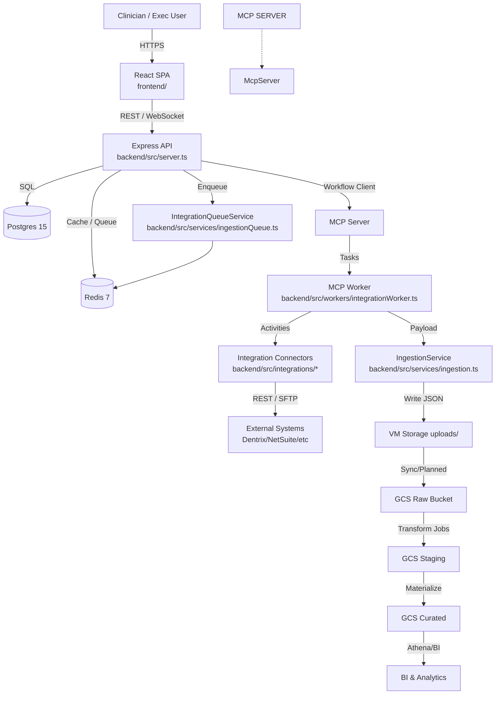
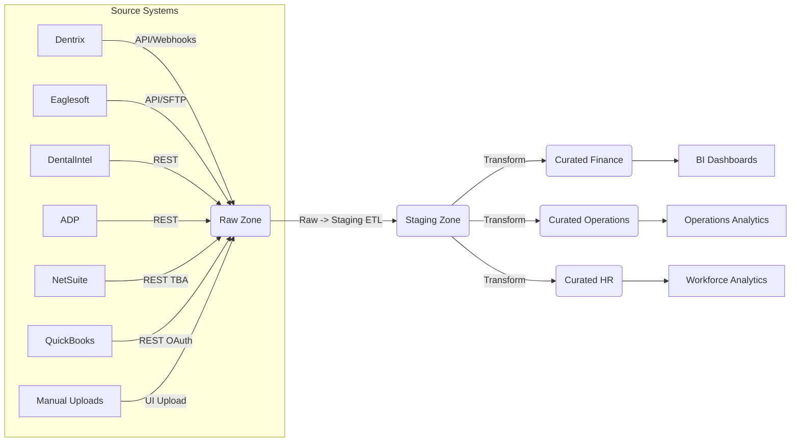

# Dental ERP Data Integration Specification

## 1. Overview
This document defines the ingestion and integration architecture for the Dental ERP data lake. It covers source systems, data domains, schema design, ingestion flows, transformation strategy, quality controls, and operational requirements.

## 2. Source Systems & Domains
- **Dentrix**: Practice management (patients, appointments, treatments, billing).
- **Eaglesoft**: Alternative practice management (financials, insurance, scheduling).
- **DentalIntel**: Analytics KPIs (production, collections, case acceptance).
- **ADP**: HR and payroll (employees, hours, compensation).
- **NetSuite**: ERP (general ledger, transactions, subsidiaries).
- **QuickBooks**: Accounting (invoices, payments, cash flow).
- **Manual Uploads**: CSV/PDF ingestion via UI for backfill or supplemental data.

## 3. Current Application & Ingestion Architecture (GCP VM)
- **Hosting**: Single Google Compute Engine VM running `docker-compose.yml` from the repo root.
- **Containers** (all defined in `docker-compose.yml`):
  - `frontend`: React SPA (`frontend/`) served via Node.
  - `backend-prod`: Express API (`backend/src/server.ts`) exposing REST endpoints (e.g., `backend/src/routes/integrations.ts`).
  - `temporal`: MCP server with Postgres persistence using `temporal/config/dynamicconfig/development.yaml`.
  - `temporal-worker`: Node worker (`backend/src/workers/integrationWorker.ts`) executing workflows from `backend/src/workflows/`.
  - `temporal-ui`: MCP Web UI for monitoring executions.
  - `postgres`: Primary OLTP database seeded via Drizzle migrations (`backend/src/database/`).
  - `redis`: Queue/cache backing `IntegrationQueueService` (`backend/src/services/ingestionQueue.ts`).
- **Internal Networking**: Docker bridge network; services communicate via container names (e.g., `backend-prod` connects to `temporal:7233`).
- **Storage**:
  - API ingestion payloads written to VM filesystem under `uploads/` by `IngestionService` (`backend/src/services/ingestion.ts`), with roadmap to migrate to GCS buckets.
  - Postgres persists to attached disk; backups scheduled via snapshots.

### 3.1 Request & Workflow Sequence
1. User interacts with SPA which calls backend REST endpoints (e.g., `POST /api/integrations/ingestion/api/enqueue`).
2. `backend/src/routes/integrations.ts` validates input using `apiIntegrationSourceSchema` and requests MCP workflow execution via `triggerIntegrationSyncWorkflow`.
3. MCP server enqueues tasks on `integration-sync` queue; `backend/src/workers/integrationWorker.ts` starts worker with workflows exported from `backend/src/workflows/index.ts`.
4. Worker activities invoke vendor connectors in `backend/src/integrations/`, fetch data, and hand results to `IntegrationQueueService` / `IngestionService` for persistence.
5. Ingestion service records payload metadata in Postgres (`ingestion_jobs`), writes raw JSON to `uploads/`, and schedules downstream processing to data lake zones.
6. MCP UI exposes run history for operators, while logs are routed through `logger` (`backend/src/utils/logger.ts`).

### 3.2 Near-Term Enhancements
- Mount GCS buckets to VM or stream uploads directly via GCS SDK replacing local filesystem writes.
- Introduce Cloud VPN or VPC peering for secure API connectivity to partner systems.
- Externalize configuration (MCP namespace, secrets) via GCP Secret Manager.

## 4. Target Data Lake Architecture
- **Platform**: Object storage (e.g., AWS S3) with structured layers.
- **Zones**:
  - **Raw Zone** (landing): Immutable, partitioned by date/source, stores source-format JSON/CSV/PDF.
  - **Staging Zone** (processed): Canonical JSON/Parquet, schema-on-write, includes normalization and metadata.
  - **Curated Zone** (analytics marts): Modeled tables for BI (star schemas for finance, operations, HR).
- **Metadata Catalog**: Glue/Athena or similar to register schemas and track partitions.

## 5. Canonical Schema Design
### 4.1 Entities
- **Practice** (`practices`): id, name, PMS (Dentrix/Eaglesoft), timezone, active flags.
- **Location** (`locations`): id, practice_id, address, timezone.
- **Patient** (`patients`): id, practice_id, demographics, insurance.
- **Appointment** (`appointments`): id, patient_id, provider_id, status, scheduled_at.
- **Treatment** (`treatments`): id, appointment_id, procedure_code, amount.
- **FinancialTransaction** (`financial_transactions`): id, source_system, type, amount, currency, txn_date, practice_id.
- **GLAccount** (`gl_accounts`): id, account_number, description, subsidiary_id.
- **PayrollRecord** (`payroll_records`): employee_id, period_start, period_end, hours, wages.
- **Employee** (`employees`): id, practice_id, role, hire_date, status.
- **AnalyticsMetric** (`analytics_metrics`): metric_id, practice_id, metric_type, period, value, source.
- **Subsidiary** (`subsidiaries`): id, parent_id, name, netsuite_external_id.

### 4.2 Relationships
- `locations.practice_id -> practices.id`
- `patients.practice_id -> practices.id`
- `appointments.patient_id -> patients.id`
- `treatments.appointment_id -> appointments.id`
- `financial_transactions.practice_id -> practices.id`
- `financial_transactions.gl_account_id -> gl_accounts.id`
- `payroll_records.employee_id -> employees.id`
- `employees.practice_id -> practices.id`
- `subsidiaries.parent_id -> subsidiaries.id`

### 4.3 Metadata & Lineage
- Each table includes `source_system`, `source_id`, `ingested_at`, `ingestion_job_id`, `checksum`.
- Audit table `ingestion_jobs` (job_id, source_system, dataset, started_at, completed_at, status, record_count, error_count).

## 6. Data Flow Architecture

### 6.1 Ingestion Flow
1. **Extraction**
   - MCP workflows (`integrationSyncWorkflow`) orchestrate API pulls using vendor connectors (`backend/src/integrations/*`).
   - Responses stored as JSON in raw zone via ingestion service.
   - Manual uploads processed through ingestion queue, stored in raw zone.
2. **Landing**
   - Files written to `s3://dentalerp/raw/{source_system}/{dataset}/ingest_date=YYYY-MM-DD/`. Metadata recorded in `ingestion_jobs`.
3. **Staging Transformations**
   - Spark/Glue jobs normalize records to canonical schema. Deduplicate by `source_id` + `ingest_date`.
   - Apply type casting, reference mappings (e.g., map NetSuite subsidiary IDs to practice IDs).
4. **Curated Layer**
   - Build star schemas: Fact tables (`fact_financial_transactions`, `fact_appointments`, `fact_payroll`) with dimension tables (`dim_practice`, `dim_patient`, `dim_employee`, `dim_gl_account`).
   - Partition facts by `ingest_date` and `practice_id`.
5. **Consumption**
   - Curated marts feed the `dentalERP` application via backend APIs (`backend/src/routes/*`) for in-app dashboards and reporting.
   - Expose curated tables through Athena/Snowflake/Redshift for executive analytics (long-term).

## 7. Connection Architecture
- **Connectivity**: Private network connections (VPC endpoints) to SaaS APIs where supported (ADP, NetSuite). VPN/IP allowlisting otherwise.
- **Authentication**:
  - NetSuite: TBA (consumer key/secret, token key/secret) stored in secrets manager.
  - ADP: OAuth2 with client certificates.
  - DentalIntel: API key.
  - QuickBooks: OAuth2 (Intuit developer app).
  - Dentrix/Eaglesoft: API gateways or SFTP exports; consider managed integration partners.
  - Manual uploads: Authenticated UI with virus scanning.
- **Secret Management**: AWS Secrets Manager or Vault; rotation policies enforced quarterly.
- **Orchestration**: MCP hosted in Docker (`docker-compose.yml`) orchestrates ingestion workflows via `integrationSyncWorkflow` and queue workers.

## 8. Data Quality & Validation Rules
- **Schema Validation**: Zod schemas per connector to validate API payload shape before landing.
- **Required Fields**:
  - Patients: `patient_id`, `first_name`, `last_name`, `practice_id`.
  - Appointments: `appointment_id`, `patient_id`, `scheduled_at`.
  - Transactions: `transaction_id`, `amount`, `txn_date`, `practice_id`.
- **Conformance Checks**: Ensure date formats (ISO 8601), currency codes (ISO 4217), enumerations (status codes) converted to canonical enums.
- **Duplication**: Hash-based dedupe on (`source_system`, `source_id`, `txn_date`).
- **Referential Integrity**: Validate foreign keys (e.g., appointment references existing patient). Invalid records quarantined to `raw/quarantine` with error logs.
- **Anomaly Detection**: Monitor for outlier amounts, missing periods via scheduled QA jobs.

## 9. Error Handling & Logging
- **Ingestion Queue**: `IntegrationQueueService` retries up to configured max with exponential backoff.
- **MCP Workflows**: Activities configured with retry policies (`integrationSyncWorkflow`).
- **Logging**: Centralized logging (ELK/CloudWatch) capturing request IDs, payload metadata, errors.
- **Alerting**: PagerDuty alerts on repeated failures or SLA breaches.
- **Dead-letter**: Failed payloads stored in `raw/dead_letter/{source}/{dataset}/` with error context.

## 10. Performance & Scalability
- **Incremental Loads**: Use `lastModified`/`updatedAfter` parameters for APIs; track cursor per practice.
- **Batching**: Paginate API results; scale workers horizontally based on queue length.
- **Partitioning**: Partition staging/curated tables by `ingest_date`, `practice_id`, optionally `source_system`.
- **ELT vs ETL**: Prefer ELT (land raw data, transform in cloud compute) due to varying schemas and high volume; limited in-flight transforms (validation, metadata tagging).
- **Scalability**: Modular connectors; add new sources by implementing `fetch<Vendor>Data()`.
- **Throughput Targets**: Support hourly sync for 25 practices → ~75 API pulls/hour from NetSuite (plus pagination) with <15 min processing latency.

## 11. Security & Compliance
- **HIPAA Compliance**: Encrypt data in transit (TLS) and at rest (SSE-S3/KMS). Access controls enforced via IAM and RBAC (practice-level segregation).
- **Audit Trails**: Store ingestion logs, workflow histories (MCP) for 7 years.
- **PII Handling**: Mask or tokenize sensitive fields (SSN, financial data) in curated layer; restrict access to least privilege.
- **Retention & Archival**: Raw data retained 7 years; archived to Glacier after 2 years. Staging retained 2 years. Curated data retained 5 years with legal holds.

- **Data Schema Design**: Section 5 + appendix diagrams.
- **Data Flow Diagram**: Sections 3 & 6 mermaid graphs (export to PNG for presentations).
- **Technical Specification**: Sections 3–11; include connector details, MCP workflow references (`backend/src/workflows/*`).
- **Connection Configurations**: Section 7; enumerate required credentials, endpoints, and network prerequisites.
- **Next Steps**:
  - Finalize schema with analytics stakeholders.
  - Build Terraform to provision data lake buckets, IAM roles.
  - Implement connector modules incrementally (NetSuite, ADP, DentalIntel first).
  - Configure monitoring dashboards for ingestion SLAs.
